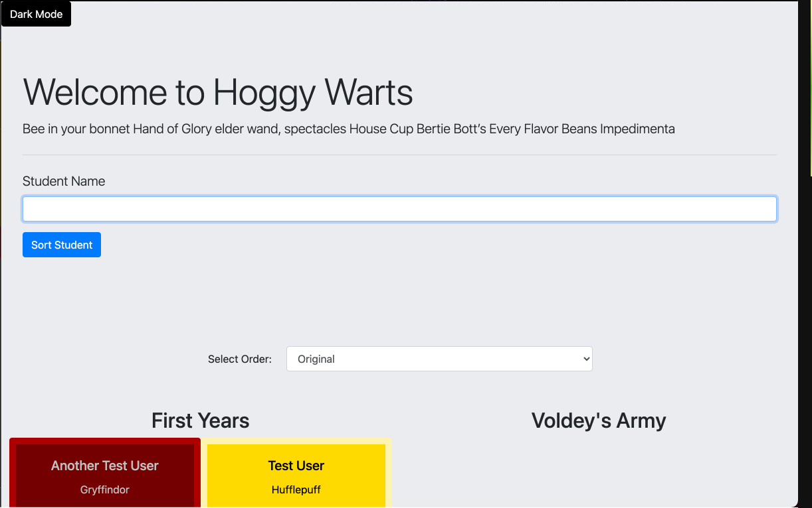
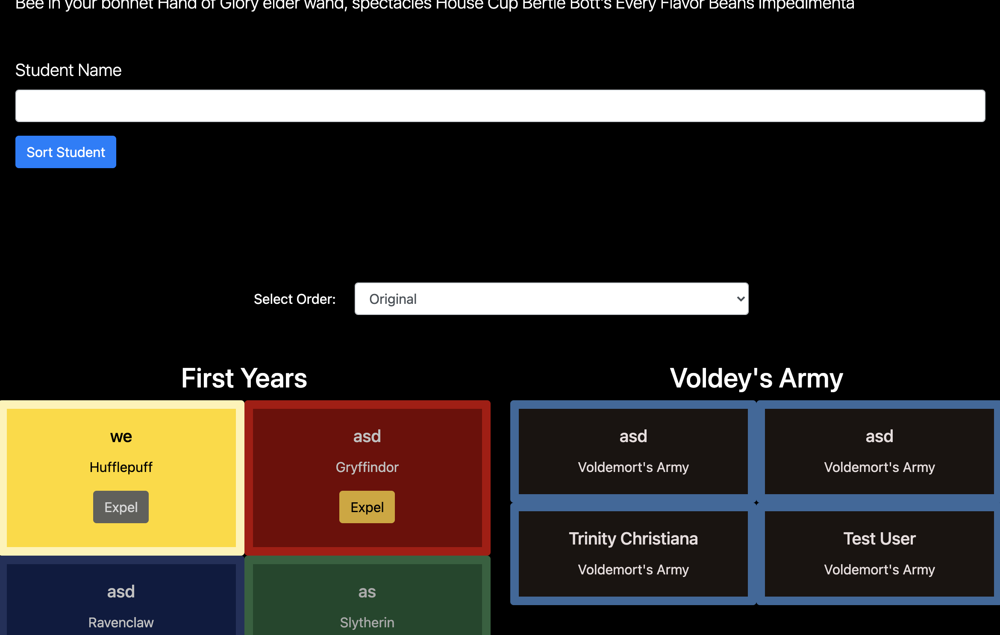
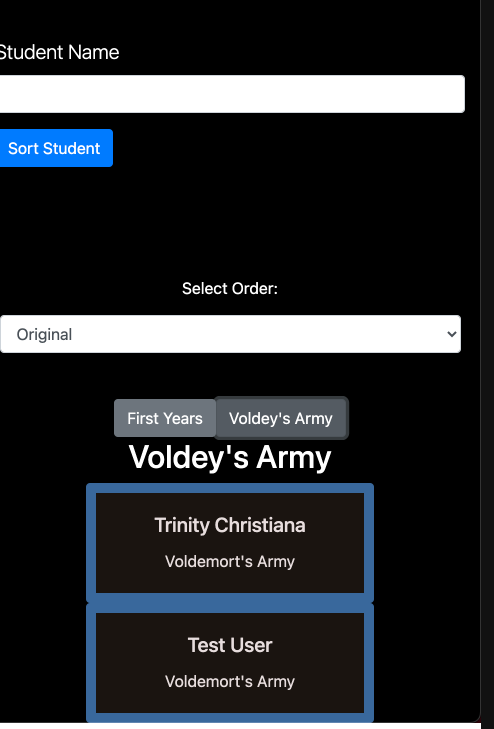
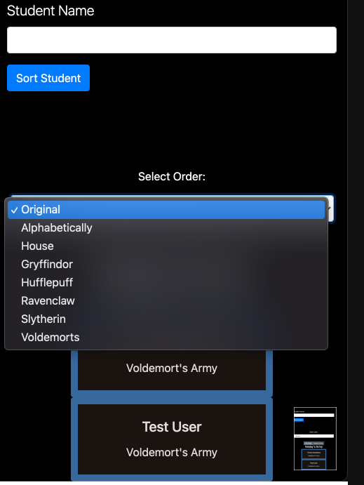

# Sorting Hat [](https://app.netlify.com/sites/trinity-christiana-sorting-hat/deploys)

This is an responsive application that allows the user to sort students randomely into different Hogwarts houses. You can also banish some students to Voldemort'ws Army.

[View App](https://trinity-christiana-sorting-hat.netlify.app/)

## Get Started

```shell
$ git clone git@github.com:TrinityChristiana/sorting-hat.git
$ cd sorting-hat
```

## Features

- When a new student is added an object should be created and that object should be pushed into an array of students that then prints to the DOM.
- House Colors: The color of the student's card changes depending on which house they were sorted.
- Card Ordering: Sort the student cards by some criteria (i.e. alphabetically by name, by house)
- Voldermort's Army: Create a separate container of cards that hold the cards for students that have been expelled. These should be styled differently from Hogwarts students.
- There is a Dark and normal theme mode
- This application is mobile responsive

<!-- ## Video Walkthrough of APP NAME
https://www.loom.com/share/829b90d831ea441ba2db6bea724af210 -->

## Relevant Links

- [Check out the deployed site](https://trinity-christiana-sorting-hat.netlify.app/)
- [Project Board](https://github.com/TrinityChristiana/sorting-hat/projects/1)

## Project Screenshots

### Home Page


### Dark Mode


### Responsiveness


### Sorting Options


## Contributors

- [Trinity Christiana](https://github.com/TrinityChristiana?tab=repositories)
